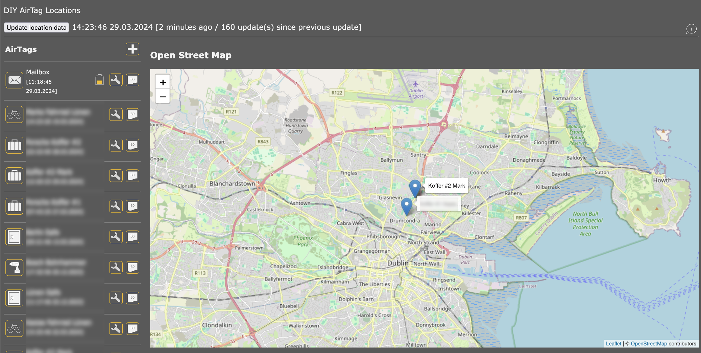

# FindMyGUI

Query Apples FindMy Network without a Mac. This application is a web server that can be used from a browser.

This based on various great projects on github:

https://github.com/biemster/FindMy
https://github.com/seemoo-lab/openhaystack/
https://github.com/JJTech0130/pypush

For map display OpenStreetMap (https://openstreetmap.org) and leaflet.js (https://leafletjs.com) is used.



## Update April 2024

The new version available since end of March 2024 contains a substantial update. It supports 
MQTT to interact with local BLE scanners:

https://github.com/liebrandapps/DIYAirTagSniffer

Firmwares transmitting the battery level in the status byte are also supported. The battery
battery level is displayed as icon. 

https://github.com/dakhnod/FakeTag

My own version for such a firmware is not yet ready for publication. I am working on it.


## Initial Setup and Configuration

You need two projects from github:

```bash
git clone https://github.com/liebrandapps/FindMyGUI
git clone https://github.com/Dadoum/anisette-v3-server
```

Build the anisette-server and get it working (it basically must be running in order to make this app functional)

For this project, you need python 3 and some dependencies:

```bash
pip3 install -r ./requirements.txt
```

## Disclaimer

Use this application at your own risk! Use this application with care especially to avoid blocking of your Apple Id. 
Read the Safety part of this file to understand the unencrypted transmission of data. No guarantee that this application
works at all times and is fit for a certain purpose.

Links were valid at time of writing this readme. I am not taking any responsible for the linked content.


## Configuration

For all configuration settings default values are defined in main.py. In case you need to configure something different, 
you need to create an ini file at the project root level. The file is called 'findMyGUI.ini' and has the standard
ini file format. 

In case your anisette server is not on the same host as this server or does not run on port 6969, you need to specify 
the values

```bash
[general]
anisetteHost=http://your_ip_here
anisettePort=your_port_number_here
```

In case you want to configure the Apple Id in the configuration file:

```bash
[appleId]
appleId=Your Apple Id
password=Your password
trustedDevice=True -> to be prompted on your Apple Device, False -> 2nd factor as SMS
```

## Safety

**NEVER RUN THIS SERVER IN AN UNSAFE ENVIRONMENT:**

Retrieval of the location data requires the use of an Apple Id and its password. Depending on how the ID is set up, you
may be required to enter a 2nd factor. You can configure your Apple Id credentials in the ini file on the server. If you 
decide to not do this (which is perfectly valid), you are asked upon retrieval of the location data in the browser. 

**Be aware that the data is transferred without encryption.**

## 2nd Factor (never reaching you)

Most Apple Ids are configured to use a 2nd factor. The web front end prompts you to enter the 2nd factor value received 
in the browser. By default, the app is configured to request the 2nd factor via SMS. If your Apple Id is configured to
receive those codes via your devices then sms may not work (and the code never arrives). If this is the case try to set
'trustedDevice' in section [appleId] of the 'findMyGUI.ini' to True. 

## Usage

The server runs on port 8008:

```bash
http://your_server_ip:8008
```

Use your (no longer functional with Mac 14) Openhaystack App to get the keys:

1. In the Web App: click "+"
2. Enter a friendly name for your tag
3. From the OpenHayStack App right click the corresponding tag and copy the private key ("Copy private key B64")
4. Paste this into the Web App private key field
5. From the OpenHayStack App right click the corresponding tag and copy the advertisement key in B64 format ("Copy advertisement key > Base64)
6. Paste this into the Web App advertisement key field
7. Press "Save"
8. Press "Update location data" to get the last known location of the tag.


## Mac OS (M1) Installation

pip3 install pycryptodome==3.11.0 --no-cache-dir --verbose --force-reinstall
